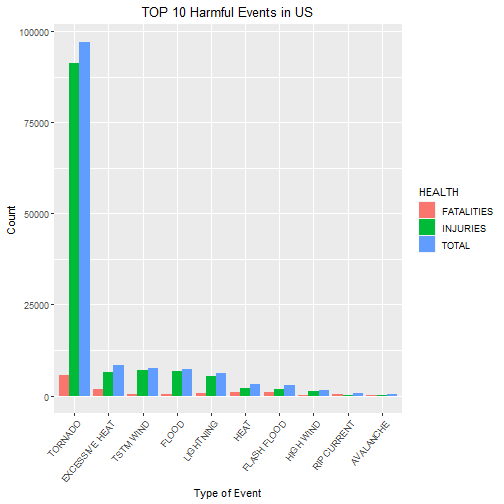
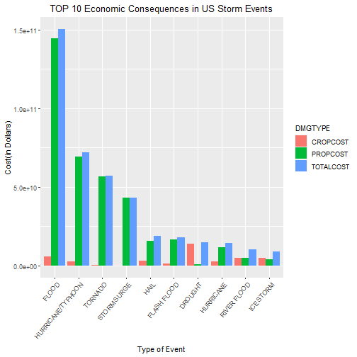

# Analysis of adverse impacts on Health and Economy because of US Storms  
##### *Ravi Teja Lakkoju* 
##### *05/06/2020*  

### **1 : Synopsis**  
This project involves exploring the U.S. National Oceanic and Atmospheric Administration's (NOAA) storm database and explore various effects it had on both people and economy. The data in the database covers the from the year 1950 to the end of November 2011.

The below analysis provides information which type of severe events are harmful on:  
  1. Health  
  2. Economy  
  
### **2 : Data Processing**  

#### 2.1 : Data Loading
Download the compressed file and expand it.And then read the data into data.frame and convert it into data.table.

```r
library("data.table")
library("ggplot2")
library("tidyr")

stormDT <- read.csv("repdata_data_StormData.csv")

#converting data.frame to data.table
stormDT <- as.data.table(stormDT)

#Dimensions of data
dim(stormDT)
```

```
## [1] 902297     37
```
#### 2.2 : Find the column in data.table

```r
names(stormDT)
```

```
##  [1] "STATE__"    "BGN_DATE"   "BGN_TIME"   "TIME_ZONE" 
##  [5] "COUNTY"     "COUNTYNAME" "STATE"      "EVTYPE"    
##  [9] "BGN_RANGE"  "BGN_AZI"    "BGN_LOCATI" "END_DATE"  
## [13] "END_TIME"   "COUNTY_END" "COUNTYENDN" "END_RANGE" 
## [17] "END_AZI"    "END_LOCATI" "LENGTH"     "WIDTH"     
## [21] "F"          "MAG"        "FATALITIES" "INJURIES"  
## [25] "PROPDMG"    "PROPDMGEXP" "CROPDMG"    "CROPDMGEXP"
## [29] "WFO"        "STATEOFFIC" "ZONENAMES"  "LATITUDE"  
## [33] "LONGITUDE"  "LATITUDE_E" "LONGITUDE_" "REMARKS"   
## [37] "REFNUM"
```
#### 2.3 : Data Subsetting
Here we take the required data columns which suit our specific requirement and subset them.
From Documentation the following are the useful columns from dataset :  
1. "EVTYPE"  
2. "FATALITIES"  
3. "INJURIES"  
4. "PROPDMG"    
5. "PROPDMGEXP"  
6. "CROPDMG"  
7. "CROPDMGEXP"  

So here we subset data and create a new data table.  

```r
colsNeeded <- c("EVTYPE", "FATALITIES", "INJURIES", "PROPDMG", 
               "PROPDMGEXP", "CROPDMG", "CROPDMGEXP")
newStormDT <- stormDT[(INJURIES > 0 | FATALITIES > 0 | PROPDMG > 0 | CROPDMG > 0), c("EVTYPE", "FATALITIES", "INJURIES", "PROPDMG", 
               "PROPDMGEXP", "CROPDMG", "CROPDMGEXP")]
```

#### 2.4: Convert to Exponents

Since amount is shortformed to alphabet numbers let revert back to exponential or numveric forms.
*(K  is thousands(10^3), M is millions(10^6), B is billions(10^9), and any other symbols are given 10^0 as the value )*


```r
# Lets Change all damage exponents to uppercase.
newStormDT[, c("PROPDMGEXP", "CROPDMGEXP")] <- lapply(newStormDT[, c("PROPDMGEXP", "CROPDMGEXP")], toupper)

# Find unique alphanumeric values
unique(newStormDT$PROPDMGEXP)
```

```
##  [1] "K" "M" ""  "B" "+" "0" "5" "6" "4" "H" "2" "7" "3" "-"
```

```r
unique(newStormDT$CROPDMGEXP)
```

```
## [1] ""  "M" "K" "B" "?" "0"
```

```r
# Map damage alphanumeric exponents to numeric values.
dmgKey <-  c("\"\"" = 10^0, "-" = 10^0, "+" = 10^0, "?" = 10^0, "0" = 10^0,
                 "1" = 10^1, "2" = 10^2, "3" = 10^3, "4" = 10^4,
                 "5" = 10^5, "6" = 10^6, "7" = 10^7, "8" = 10^8,
                 "9" = 10^9, "H" = 10^2, "K" = 10^3, "M" = 10^6, "B" = 10^9)

# Change the values in expenses to the exponential factors

newStormDT$PROPDMGEXP <- lapply(newStormDT$PROPDMGEXP, function(x) { dmgKey[as.character(x)] })
newStormDT[is.na(PROPDMGEXP), PROPDMGEXP := 10^0]

newStormDT$CROPDMGEXP <- lapply(newStormDT$CROPDMGEXP, function(x) { dmgKey[as.character(x)] })
newStormDT[is.na(CROPDMGEXP), CROPDMGEXP := 10^0]
```

#### 2.5 : Making cost columns


```r
newStormDT$PROPCOST <- with(newStormDT, as.numeric(PROPDMGEXP) * PROPDMG)
newStormDT$CROPCOST <- with(newStormDT, as.numeric(CROPDMGEXP) * CROPDMG)
```

#### 2.6 : Calculating total cost loss based on EVTYPE


```r
filteredCosts <- newStormDT[, .(PROPCOST = sum(PROPCOST), CROPCOST = sum(CROPCOST), TOTALCOST = sum(PROPCOST) + sum(CROPCOST)), by = .(EVTYPE)]

#Order the filtered data based on total costs
filteredCosts <- filteredCosts[order(-TOTALCOST), ]

#reduce the unncessary data
filteredCosts <- filteredCosts[with(filteredCosts, (PROPCOST > 0 & CROPCOST > 0))]

#lets put it down to top 10 data
filteredCosts <- filteredCosts[1:10,]

# Look at some top data
head(filteredCosts, 10)
```

```
##                EVTYPE     PROPCOST    CROPCOST    TOTALCOST
##  1:             FLOOD 144657709807  5661968450 150319678257
##  2: HURRICANE/TYPHOON  69305840000  2607872800  71913712800
##  3:           TORNADO  56947380677   414953270  57362333947
##  4:       STORM SURGE  43323536000        5000  43323541000
##  5:              HAIL  15735267513  3025954473  18761221986
##  6:       FLASH FLOOD  16822673979  1421317100  18243991079
##  7:           DROUGHT   1046106000 13972566000  15018672000
##  8:         HURRICANE  11868319010  2741910000  14610229010
##  9:       RIVER FLOOD   5118945500  5029459000  10148404500
## 10:         ICE STORM   3944927860  5022113500   8967041360
```

#### 2.7 : Calculating total Fatalities and Injuries


```r
filteredFI <- newStormDT[, .(FATALITIES = sum(FATALITIES), INJURIES = sum(INJURIES), TOTAL = sum(FATALITIES) + sum(INJURIES)), by = .(EVTYPE)]

#Order the filtered data based on fatalities
filteredFI <- filteredFI[order(-FATALITIES), ]

#reduce the unncessary data
filteredFI <- filteredFI[with(filteredFI, (FATALITIES > 0 & INJURIES > 0))]

#lets put it down to top 10 data
filteredFI <- filteredFI[1:10,]

# Look at some top data
head(filteredFI, 10)
```

```
##             EVTYPE FATALITIES INJURIES TOTAL
##  1:        TORNADO       5633    91346 96979
##  2: EXCESSIVE HEAT       1903     6525  8428
##  3:    FLASH FLOOD        978     1777  2755
##  4:           HEAT        937     2100  3037
##  5:      LIGHTNING        816     5230  6046
##  6:      TSTM WIND        504     6957  7461
##  7:          FLOOD        470     6789  7259
##  8:    RIP CURRENT        368      232   600
##  9:      HIGH WIND        248     1137  1385
## 10:      AVALANCHE        224      170   394
```


### **3: Results**

#### 3.1 : Events that are Most Harmful to Population Health


```r
# Gather the data to fit into graph model
filteredFI <- gather(filteredFI, HEALTH, VALUE, FATALITIES:TOTAL)

healthChart <- ggplot(filteredFI, aes(x = reorder(EVTYPE, -VALUE), y = VALUE))

healthChart <- healthChart + geom_bar(stat = "identity", aes(fill = HEALTH), position = "dodge")

healthChart <- healthChart + labs(x = "Type of Event", y = "Count", title = "TOP 10 Harmful Events in US")

healthChart <- healthChart + theme(axis.text.x = element_text(angle = 50, hjust = 1), plot.title = element_text(hjust = 0.5)) 

healthChart
```



#### 3.2 : Events that are Most Harmful to Economy


```r
# Gather the data to fit into graph model
filteredCosts <- gather(filteredCosts, DMGTYPE, VALUE, PROPCOST:TOTALCOST)

economyChart <- ggplot(filteredCosts, aes(x = reorder(EVTYPE, -VALUE), y = VALUE))

economyChart <- economyChart + geom_bar(stat = "identity", aes(fill = DMGTYPE), position = "dodge")

economyChart <- economyChart + labs(x = "Type of Event", y = "Cost(in Dollars)", title = "TOP 10 Economic Consequences in US Storm Events")

economyChart <- economyChart + theme(axis.text.x = element_text(angle = 50, hjust = 1), plot.title = element_text(hjust = 0.5)) 

economyChart
```




