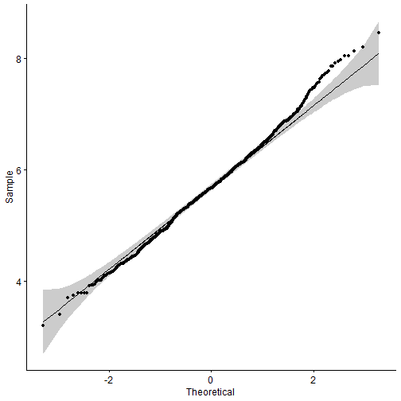

<h3 position = "right">Statistical Inference Project 1</h3>
by, <h4><b><i>Ravi Teja L</i></b></h4>
*22-06-2020*
</br>
<h2 style = "background-color :#AFAFAF; color: black"><center>Part-1</center></h2>
</br>
<h3><center><b>
Comparing Exponential Distribution in R to Central Limit Theorem</b></center></h3>
</br>
### **Instructions**

1. Show the sample mean and compare it to the theoretical mean of the distribution.
2. Show how variable the sample is (via variance) and compare it to the theoretical variance of the distribution.
3. Show that the distribution is approximately normal.

## Loading Libraries


```r
library("data.table")
library("ggplot2")
library("dplyr")
library(tidyr)
library(ggpubr)
```

## Production


```r
# set seed
set.seed(31)

# set lambda
lambda <- 0.2

# samples
n <- 40

# simulations
simulations <- 1000

samples <- matrix(sample(rexp(n, lambda), n*simulations, replace = TRUE), n, simulations)

sampleMeans <- apply(samples, 2, mean)
```

# **Question-1**

Show the sample mean and compare it to the theoretical mean of the distribution.


```r
obtainedMean <- mean(sampleMeans)
obtainedMean
```

```
## [1] 5.683866
```

```r
basicMean <- 1/lambda
basicMean
```

```
## [1] 5
```

```r
t.test(sampleMeans)$conf
```

```
## [1] 5.633892 5.733841
## attr(,"conf.level")
## [1] 0.95
```

```r
t.test(sampleMeans)$p.value
```

```
## [1] 0
```

* Based on the comparision we can understand the fact that the true mean must be definitely greater than 5 i.e., Theoretical Mean.
* This is due to the fact that the theoretical mean is less than the 95% confidence interval of resampled data.
* Hence we reject the Null Hypothesis that True Mean is equal to 5.


```r
hist(sampleMeans, xlab = "Means", ylab = "Simulations", density = 30, col = "grey")
abline(v = basicMean, col = "red")
abline(v = obtainedMean, col = "blue", )
text(x = obtainedMean,y = 0,"Sample Mean")
```


# **Question-2**

Show how variable the sample is (via variance) and compare it to the theoretical variance of the distribution


```r
sampleSds <- sd(sampleMeans)
sampleSds
```

```
## [1] 0.805329
```

```r
basicSd <- (1/lambda)/sqrt(n)
basicSd
```

```
## [1] 0.7905694
```

```r
sampleVariances <- sampleSds^2
sampleVariances
```

```
## [1] 0.6485548
```

```r
basicVariance <- basicSd^2
basicVariance
```

```
## [1] 0.625
```

* Standard Deviation of the distribution is 0.805329 with the theoretical SD calculated as 0.7905694. The Theoretical variance is 0.625. 
* The actual variance of the distribution is 0.6485548

# **Question-3**
Show that the distribution is approximately normal


```r
ggplot(data.frame(sampleMeans), aes(x=sampleMeans)) +
geom_histogram(aes(y = ..density..), binwidth=.25, colour="black", fill="grey")+
stat_function(fun = dnorm, lwd = 2, col = 'red', args = list(mean = mean(sampleMeans), sd = sd(sampleMeans))) 
```


From the above graph we can tell that the data is normally distributed.


```r
ggqqplot(sampleMeans)
```



As all the points fall approximately along this reference line, Hence we can assume normality.
Due to Due to the **Central limit theorem (CLT)**, the distribution of averages of 40 exponentials is very close to a normal distribution.
